<div align="center">

# Prompt Tree

**Branch. Prove. Ship.**

The offline-first, browser-only, git-style operating system for prompts.
Where other tools *collect* prompts, Prompt Tree **graduates** them —
versioned, peer-reviewed, evaluated, and shippable.

[Quick start](#quick-start) · [Features](#what-it-does) · [AI providers](#ai-providers) · [Architecture](#architecture) · [Roadmap](#roadmap) · [The long vision — GitHub for Prompts](#the-long-vision--github-for-prompts)

</div>

---

## The one-line pitch

Prompt Tree treats every prompt as an **immutable versioned artifact** with
lineage, evidence, and decisions — not a text blob. Fork branches like git,
diff any two versions, run them against test cases, attach evaluations,
open pull-request-style proposals, and promote winners into a canonical
branch. **Nothing is overwritten; everything is retrievable.**

## The problem we fix

- **Prompts drift silently.** Edits overwrite history. Good phrasings get lost.
- **"Improvements" are unverified.** Nobody runs the new version against the old one on the same inputs.
- **Branching is implicit.** `prompt_v2_final_FINAL_use_this.txt` is a real file in a real repo somewhere.
- **Promotion is a vibe, not a record.** "We're using v3 now because Ada said so in Slack."
- **Retrieval is weak.** Three weeks later nobody can find "the version we used for the customer-support tone experiment".

Prompt Tree keeps the receipts.

## Why browser-first

The whole product runs on GitHub Pages. No backend, no sign-up, no vendor
lock-in. Your data lives in **IndexedDB** in your browser. Export the entire
workspace as JSON in one click; import it in another tab or on another
machine. When we eventually add a backend (see the [roadmap](#roadmap)), the
browser-only path stays the default — the server will *extend*, never
*replace*, local workflows.

---

## What it does

Everything listed below is **shipped and working in the demo** today. Press
`/` or <kbd>⌘ K</kbd> in the app to search; press <kbd>?</kbd> to open the
full reference.

### 1. Version-controlled prompts, git-style

- **Projects** contain many **prompts**; each prompt contains many **branches**, each a pointer into the **version DAG**.
- Every edit creates a new version — old ones are permanently addressable by id.
- `contentHash` is part of the version, so "is this the same prompt?" has a hard answer.
- One branch per prompt is **canonical** (default `main`) — it answers "what should I ship?".
- Fork a version into a new branch. Cherry-pick. Promote (pointer fast-forward *or* squash-onto-canonical). Deprecate. Archive. Every governance action writes a `PromptDecision` row with required rationale — never silent.

### 2. Line-level diffs + blame

- Compare **any two versions** side-by-side with per-line diffs and word-level highlight inside modified lines.
- **Blame view**: toggle the Content tab's *Show blame* button; every line shows which version introduced it, with an avatar and the change summary. Click the gutter to jump to that version.

### 3. Runs & evaluations

- A **run** is the full execution envelope: the rendered prompt (with variable substitution), the raw model output, structured output (if JSON), token counts, latency, provider, cost estimate, test-case reference, seed, model-profile id. Runs are never mutated.
- Pluggable **evaluators** — regex/contains, JSON-schema conformance, similarity (Jaccard-token), rubric (criterion × weight), mock LLM-judge. Multiple evaluators per run are normal.
- **Batch run**: one version across N model profiles × M test cases in one click (<kbd>B</kbd> hotkey). Every cell is an ordinary run, so the Trend chart and A/B summary pick it up automatically.
- **Export all runs** on a version as a stable `prompt-tree-runs/1` JSON bundle — schema is versioned and documented in [`docs/run-format.md`](docs/run-format.md).

### 4. Proposals (pull-requests for prompts)

- Instead of promoting directly, open a **proposal** from any version with a title + description.
- Proposal page shows the diff, **inline line-anchored review comments**, a discussion thread, and the paired run-evidence table.
- **Approval gate**: configurable N approvals required to merge. The merge button is truly disabled (dimmed + grayscale) until the gate opens; self-approval by the opener is blocked. Approvals are revocable.
- Merge = squashed (linear main) or pointer fast-forward. Decline = logged decision.

### 5. A/B testing with statistical significance

- The Compare view computes **Wilson score intervals** for the pass-rate on each side and a **Newcombe method-10 CI for the difference**.
- You get an honest "B > A at 95 %" / "A > B at 95 %" / "not significant" badge instead of eyeballing averages.
- Pass = evaluator score ≥ 0.5. Null scores are ignored (missing, not failing). CI is clamped to ±1 for display; significance is decided on the raw bounds.

### 6. Score trend chart

- Per-prompt SVG line chart of mean evaluator score over versions, plus a line per test case.
- Hover any dot for `vN · test case · X%`; click to jump to that version.
- Sidebar shows the latest mean and the delta vs. the previous version.

### 7. Refinement suggestions

- Five domain analyzers (ambiguity, missing constraints, unclear role, redundancy, under-specification) inspect the current version and return typed findings.
- A heuristic **proposer** drafts a refined version; accepting it **forks a new branch** named `refine-vN-XXXX` and writes a `refinement` lineage edge — not a silent overwrite.

### 8. Collaboration layer

- Per-project **members** with avatars + colour chips.
- **Activity feed** per prompt and per project. Every service writes an event: `version_created`, `version_promoted`, `branch_created`, `run_completed`, `proposal_opened`, `proposal_merged`, `release_published`, `proposal_approved`, `proposal_unapproved`, …
- **Releases**: tag a canonical version with release notes auto-drafted from intervening change summaries.
- **README per prompt**, rendered with [marked](https://github.com/markedjs/marked) (vendored).

### 9. Keyboard-first UX

- <kbd>⌘ K</kbd> / <kbd>/</kbd> — fuzzy command palette (Fuse.js) across all projects, prompts, versions
- <kbd>E</kbd> — edit → new version
- <kbd>F</kbd> — fork
- <kbd>R</kbd> — run
- <kbd>B</kbd> — batch run (matrix modal)
- <kbd>?</kbd> — open Help from anywhere
- <kbd>Esc</kbd> — close modal / palette / drawer

### 10. Offline & portable

- **IndexedDB** for state, **localStorage** for theme + tour flag, **separate IndexedDB store** for encrypted API keys (AES-GCM at-rest, never exported).
- **Export**: one JSON file with the entire workspace (prompts, versions, branches, runs, evaluations, proposals, decisions, readmes, activities). Secrets are excluded.
- **Import**: drop it in another browser or tab — state is restored byte-identical.
- **Cross-tab sync**: BroadcastChannel keeps every open tab in lockstep.
- **Reset demo** button in the topbar restores the seeded demo without touching your keys.

---

## Concepts glossary

If you came from code hosting, the mapping is clean:

| GitHub | Prompt Tree |
|---|---|
| Repository | Project |
| File | Prompt |
| Branch | Branch |
| Commit | Version |
| Pull request | Proposal |
| Tag | Release |
| Issue | *(coming in Phase F)* |
| CI check | Evaluation |
| Merge commit with rationale | PromptDecision |

Formal definitions live in [`docs/02-domain.md`](docs/02-domain.md). The
invariants there are not suggestions.

---

## Quick start

Prompt Tree ships in **two execution surfaces** that share the same domain
model. Pick whichever matches your use case.

### Surface A — the browser-only webapp (recommended)

No build step, no database, no account. Just serve the `webapp/` folder:

```bash
# Clone the repo
git clone https://github.com/BEKO2210/Prompt-Versionierung
cd Prompt-Versionierung

# Any static server works; Python's one-liner is fine.
cd webapp && python3 -m http.server 8080
```

Open `http://localhost:8080` → you'll see the seeded **Demo** project.
The first-run tour walks you through 7 real surfaces (activity feed,
version tree, proposals, run modal, settings, shortcuts). Replay any
time via the *Tutorial* button in the topbar.

The same folder is what GitHub Pages serves at deploy time — see
`.github/workflows/pages.yml`.

**Don't open `index.html` with a double-click.** The `file://` protocol
blocks ES-module imports and `fetch("./data/seed.json")`. You'll see
only the splash. Always go through HTTP.

### Surface B — the Next.js + Prisma reference

For teams that want a proper backend today (sqlite/postgres, server
actions, CI build artifacts), there's a full Next.js implementation of
the same service layer.

```bash
# 1. install deps
npm install

# 2. init the database (SQLite file in prisma/dev.db)
cp .env.example .env
npx prisma generate
npx prisma db push

# 3. seed a demo project (optional but recommended)
npm run db:seed

# 4. run the app
npm run dev
```

Open `http://localhost:3000`, pick the `demo` project, open the
`ticket-classifier` prompt. Everything you can do in the browser-only
webapp is mirrored here, plus a real SQL-backed query surface for when
your workspace grows past a few dozen prompts.

---

## AI providers

By default every run goes through the deterministic **mock** adapter — the
whole product loop (fork → edit → run → evaluate → promote) works with
**no API key at all**. Swap to a real provider when you want real outputs.

### Bring your own key (browser-only)

Open `#/settings` (or the *Settings* link in the topbar). Paste your key
for any of the three real providers. Keys are stored **only in this
browser** under `prompt-tree` → `secrets` in IndexedDB, encrypted with
**AES-GCM** bound to this origin. They are:

- **Never** included in Export / Import
- **Never** crossed between tabs via BroadcastChannel
- **Never** sent to any server (there is no server)
- **Deleted** when you clear browser data — there is no remote copy

If a provider's key is missing when you run, the run row records
`mocked: true` + `mockedReason: "no key for <provider>"` so the Trend
chart and A/B summary can distinguish real from mock scores.

### Supported providers

| Provider | Models | Auth | Notes |
|---|---|---|---|
| **Anthropic (Claude)** | Any `claude-*` id | `x-api-key` header + `anthropic-dangerous-direct-browser-access: true` | Direct-browser calls; the CORS-safe header is required by the API |
| **OpenAI** | `gpt-4o*`, `gpt-4.1*`, `o1*`, `o3*`, `o4*` | `Authorization: Bearer …` | o-series folds `system` into a leading user message and uses `max_completion_tokens`; handled transparently |
| **Google Gemini** | `gemini-*` | `x-goog-api-key` header (never in URL) | `system` → `systemInstruction`; safety-block responses are surfaced as a typed error |
| **Mock** | `mock-default` (or any id) | — | Deterministic offline fallback — perfect for CI, demos, and unit-testing evaluators |

### Cost preview

Before you run, the Run modal shows `≈ N input tokens · ~$X input cost`
live, recomputing on every keystroke in the bindings textarea. It uses:

- **Token counting**: [js-tiktoken](https://github.com/dqbd/tiktoken) (vendored) for OpenAI families; `chars/4` fallback otherwise. Method label `"≈"` flags the estimate.
- **Pricing**: `webapp/js/pricing.js` keeps a per-model `$/M tokens` table with longest-prefix family matching (so `claude-opus-4-7-20260101` picks up the `claude-opus-4` row). Rates are **statically versioned in the repo** — update them with a PR.

The same block is shown in the Batch modal summed across every selected
cell: `"N runs (P models × C cases) ≈ $X input cost · output billed
per-token"`.

### Next.js surface (Surface B)

Set `MODEL_PROVIDER=anthropic` and `ANTHROPIC_API_KEY=sk-…` in `.env`,
then create a `ModelProfile` with `provider="anthropic"` and a real
model id. Swapping providers does not touch domain or service code —
new providers are one file under `src/adapters/models/` plus one line in
`registry.ts`.

### Adding a new provider

1. Create `webapp/js/adapters/models/<name>.js` (and optionally `src/adapters/models/<name>.ts` for Surface B).
2. Implement the adapter contract — the shape is documented in `webapp/js/adapters/models/types.js` and every existing adapter is a fine template (see `anthropic.js`, `openai.js`, `gemini.js`).
3. Register it in `webapp/js/adapters/models/registry.js`.
4. Add pricing rows to `webapp/js/pricing.js`.
5. Add a Settings row to `webapp/js/views/settings.js` so users can paste a key.
6. Done. The Run modal, Batch modal, Runs table, Trend chart, A/B summary all pick it up automatically.

---

## Architecture

### Layering rule

The same four layers on both surfaces; the rule is enforced by review
and — soon — by lint.

```
app/  or  webapp/js/views/       ← UI. Calls services only. Never touches DB or providers.
src/services/  or  webapp/js/services.js  ← owns every write. Calls domain + adapters.
src/domain/   or  webapp/js/domain.js     ← pure. No DB, no fetch, no env. Invariants live here.
src/adapters/ or  webapp/js/adapters/     ← pluggable I/O: Prisma, model providers, evaluators.
```

**Never** import Prisma from UI code. **Never** call model providers
from domain code. The webapp mirrors the exact same layering — that's
why both surfaces can share the same mental model.

### Invariants you do not break

Straight from [`docs/02-domain.md`](docs/02-domain.md):

1. **Versions are immutable.** The only field that may transition is `status`. Body, parent, number, and `contentHash` are write-once. Editing a prompt always creates a *new* version.
2. **Every governance action is a `PromptDecision`.** Promote, deprecate, archive, set-canonical-branch — atomic write of the decision row with its rationale.
3. **Every lineage-changing operation that can't be represented by a single `parentVersionId` writes a `PromptLineageEdge`.** Kinds: `branch`, `merge`, `cherry_pick`, `refinement`.
4. **Every state-changing service records an activity event.** No silent mutations.
5. **Exactly one canonical branch per prompt.** Setting canonical is itself a logged decision.

### Tech stack

| Layer | Webapp (offline) | Next.js reference |
|---|---|---|
| UI | Vanilla ES modules + hand-written CSS | Next.js 15 App Router + React 19 + Tailwind |
| State | IndexedDB (`prompt-tree` db, `kv` store) + localStorage fallback | Prisma ORM + SQLite (dev) / Postgres (prod) |
| Types | JSDoc where it helps | TypeScript strict mode |
| Routing | 75-line hash router | Next App Router file-based routing |
| Cross-tab sync | `BroadcastChannel` | — |
| Secrets | Separate IDB store, AES-GCM at-rest | `.env` |
| Tests | Shared — same Vitest suite runs against pure `src/domain/**` | |
| CI | 4 jobs: domain-tests, typecheck, lint, build | |
| Deploy | GitHub Pages (`.github/workflows/pages.yml`) | Any Node-capable host |

### Vendored dependencies (webapp)

We keep the runtime dependency graph **tiny**. Every vendored library
must be a pure ES module, work on GitHub Pages with no build step, have
no transitive deps we don't ship, and carry a permissive licence.

| Library | Why | Licence |
|---|---|---|
| [`marked`](https://github.com/markedjs/marked) | Real markdown for READMEs + proposal descriptions | MIT |
| [`fuse.js`](https://fusejs.io) | Fuzzy command palette + search ranking | Apache-2.0 |
| [`js-tiktoken`](https://github.com/dqbd/tiktoken) | Token counting → cost prediction | MIT |

Loaded under `webapp/vendor/<name>/`, imported via relative ES module
URLs — **no CDN at runtime** so the app stays fully offline-capable.

---

## Screenshots

The headless walkthrough captures these on every commit (see
[`scripts/ui-walkthrough.js`](scripts/ui-walkthrough.js)). They are the
**actual app on the demo seed** — not mockups.

### Workspace, project, prompt — the three primary screens

| Workspace | Project dashboard |
|---|---|
| 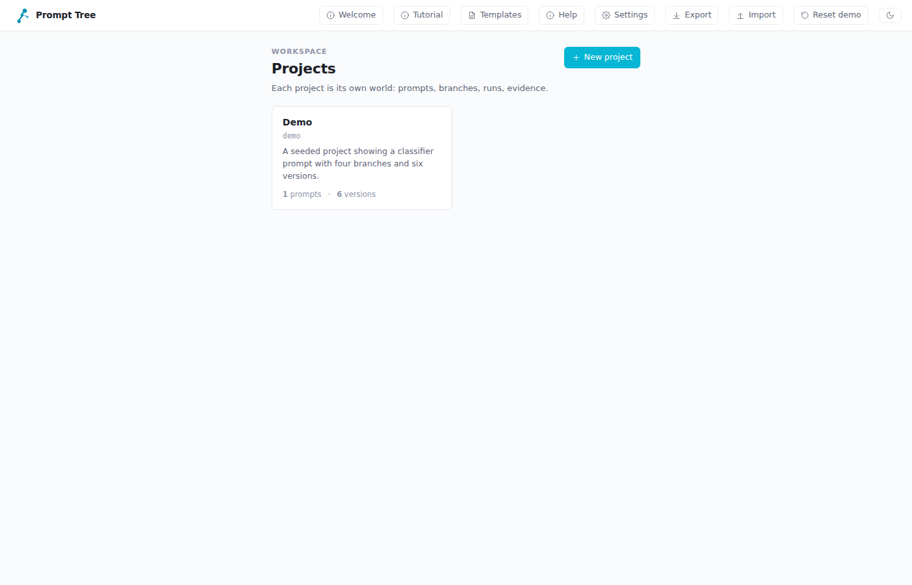 | 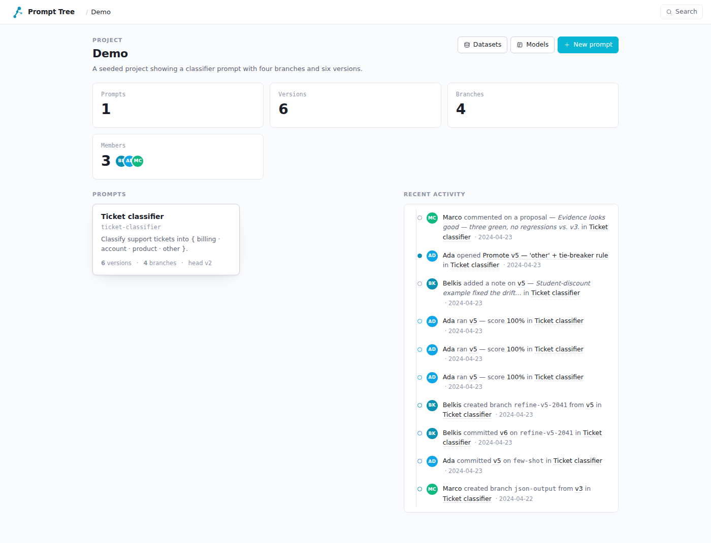 |
| Project list with counts. Topbar carries Tutorial / Help / Settings / Export / Import / Reset / Theme. | Live counters (prompts, versions, branches, members), the prompts grid, and the project's recent activity feed. |

The prompt view is where you spend most of your time:

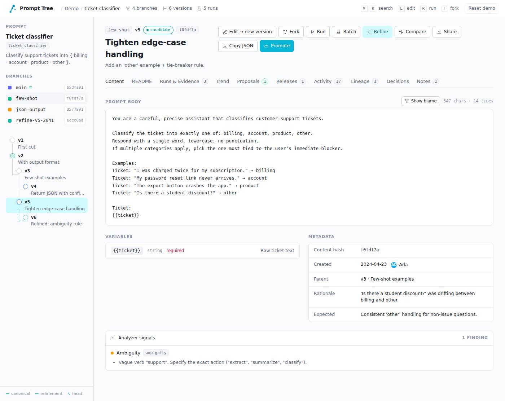

Left rail: prompt card, branch list (canonical crowned, hash chips), the
DAG-shaped version tree. Main pane: breadcrumbs (`branch · vN · status ·
hash`), action bar (Edit / Fork / Run / Batch / Refine / Compare /
Promote), tabs, content + variables + metadata + analyzer signals.

### Tabs on the prompt view

| README | Runs & Evidence |
|---|---|
| 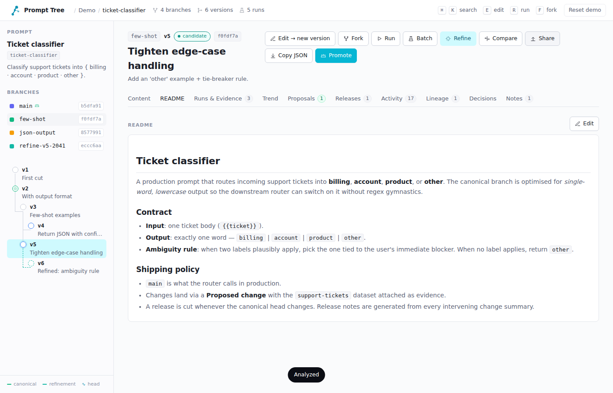 | 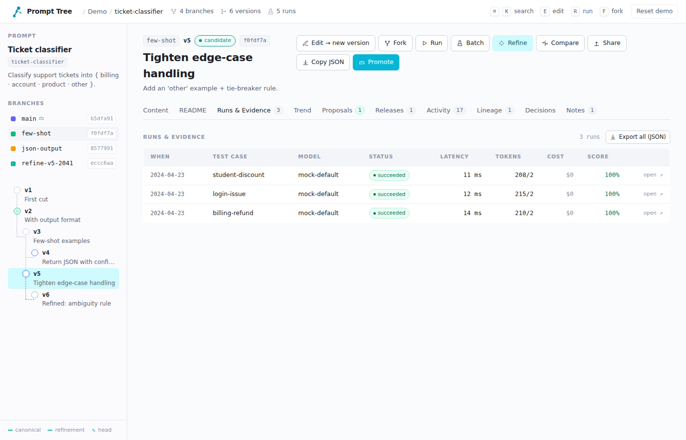 |
| Per-prompt README, real markdown via vendored marked. | Every run on this version with score, cost, latency, provider, and the test case. Click any row to open the run drawer. |

| Trend | Activity |
|---|---|
| 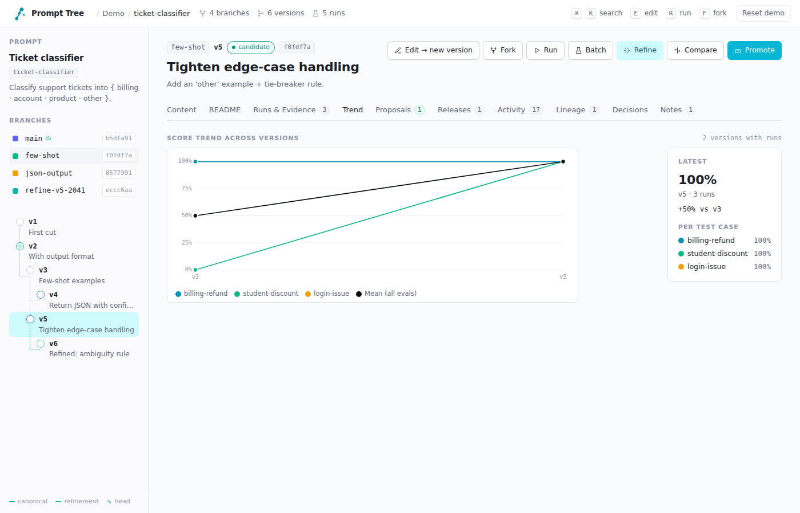 | 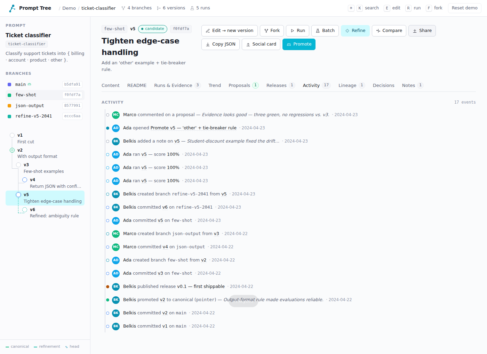 |
| Hand-rolled SVG chart with mean line + per-test-case lines, hover tooltips, click-to-jump. | Append-only log: version_created, run_completed, proposal_opened, …. |

| Lineage | Decisions |
|---|---|
| 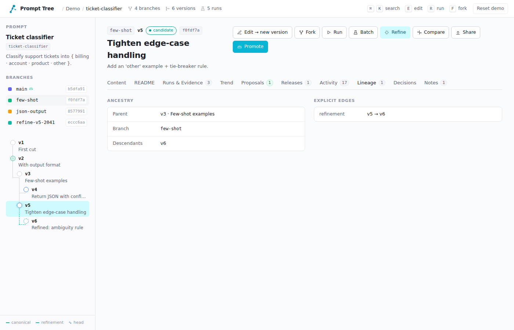 | 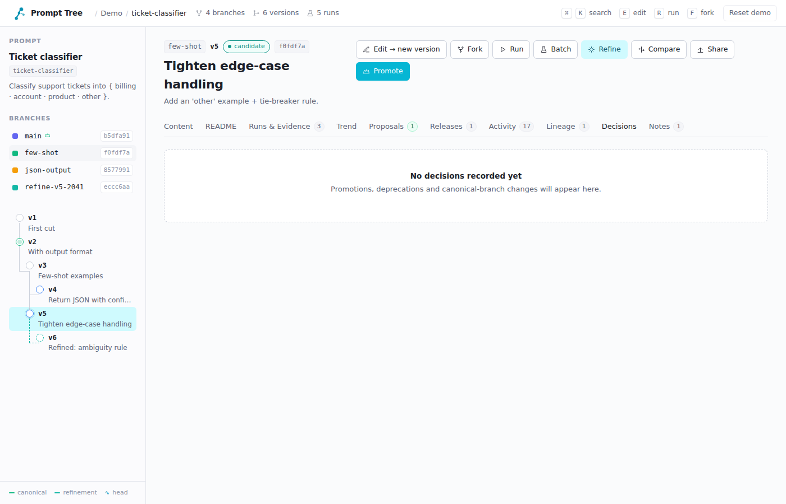 |
| Parent + descendants + explicit edges (`branch`, `merge`, `cherry_pick`, `refinement`). | The audit trail. Promote and friends never silent. |

| Notes | Releases |
|---|---|
| 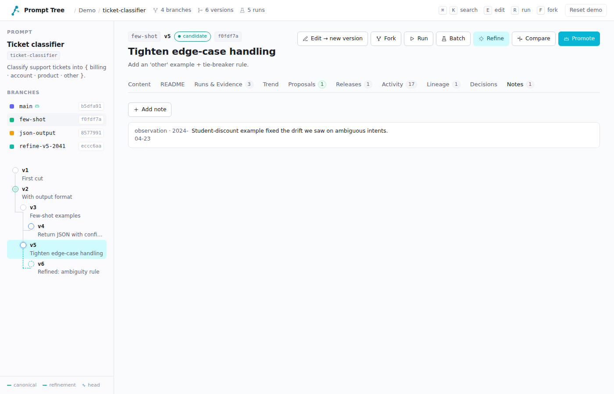 | 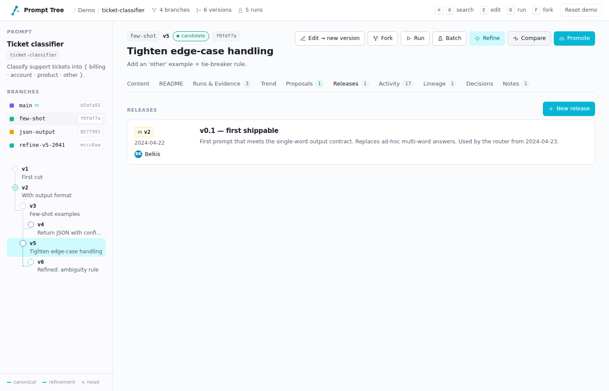 |
| Free-form per-version notes typed by humans. | Tag a canonical version; release notes are auto-drafted from change summaries. |

---

**→ Teil 3a fertig. Sag „weiter" für 3b (Modals + Compare + Blame Screenshots).**
